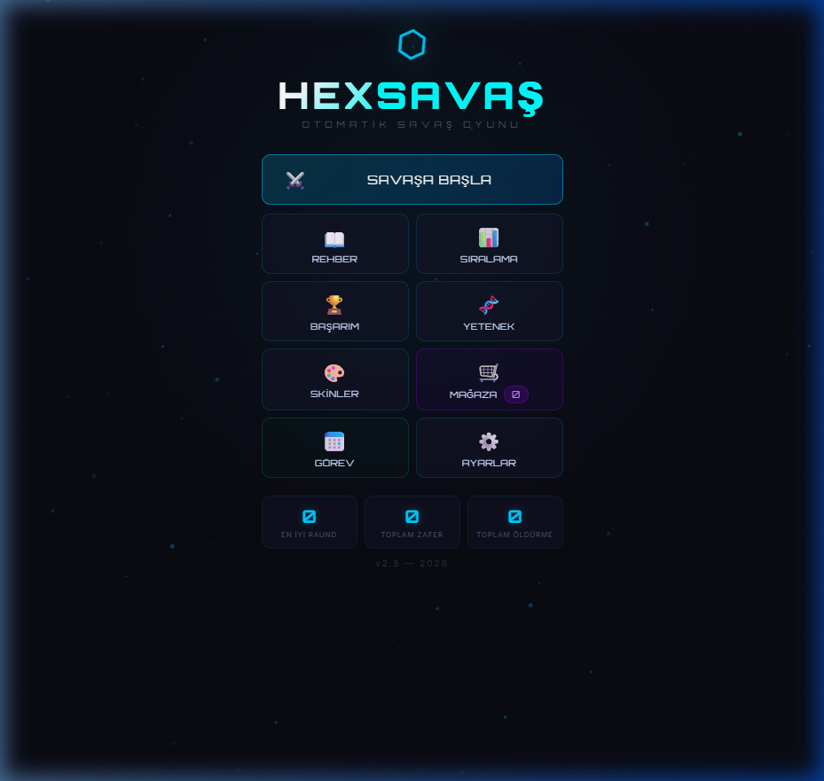
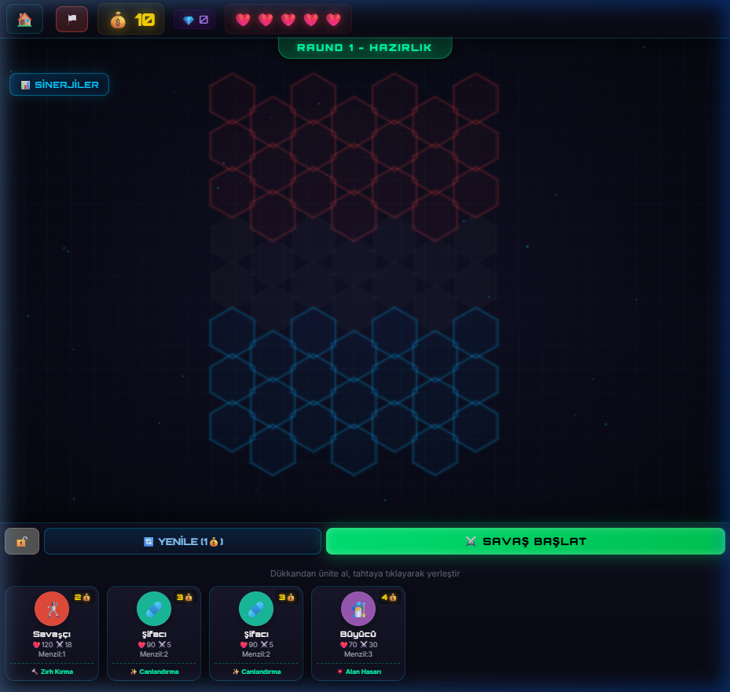
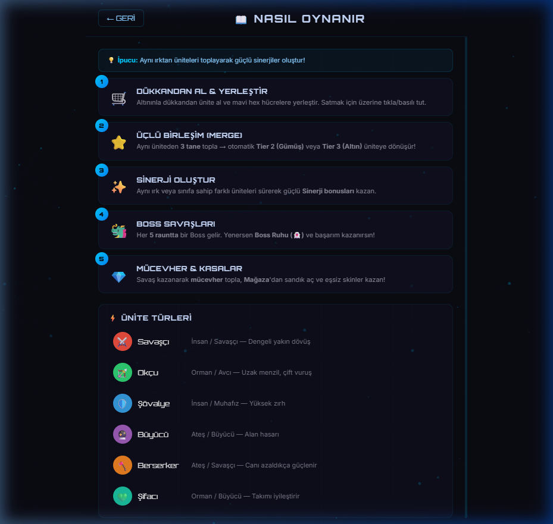
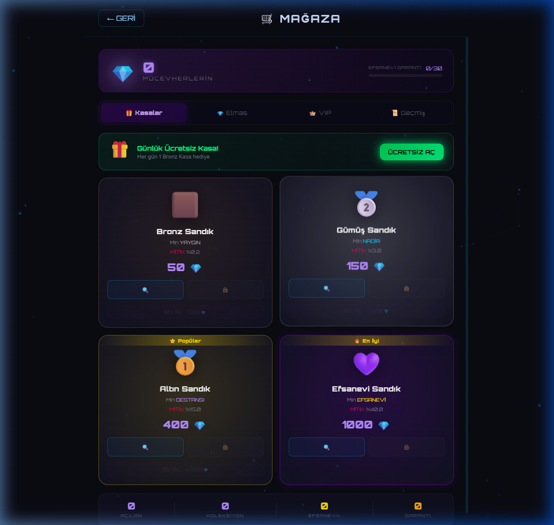
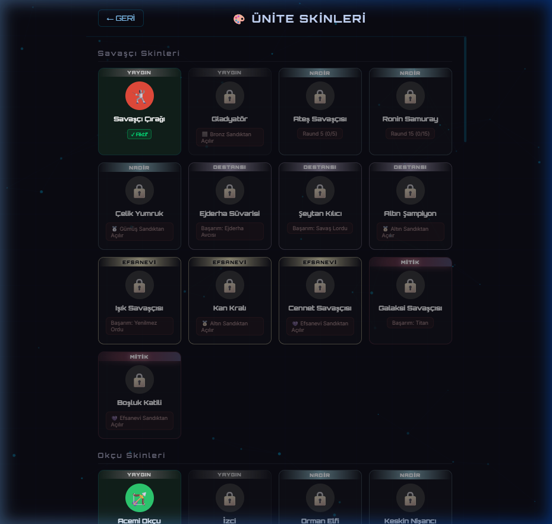
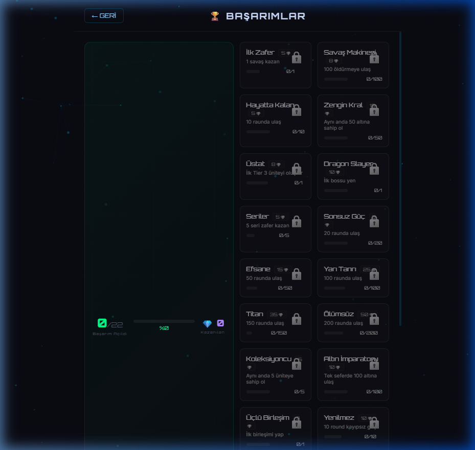

# Hex Savaş

**Öğrenci Adı Soyadı:** Arda Elitez  
**Öğrenci Numarası:** 24010501118  

[](https://github.com/ArdaElitez/HexSavas)
[]()
[]()

## 📌 Projenin Amacı ve Kısa Açıklaması
**Hex Savaş**, oyuncuların stratejik düşünerek birimler satın aldığı, bu birimleri altıgen (hex) tabanlı bir savaş alanına yerleştirdiği ve dalga dalga gelen düşmanlara (ve her 5 rauntta bir gelen Boss karakterlere) karşı hayatta kalmaya çalıştığı bir *Auto Battler* (Otomatik Savaş) oyunudur. 

Projenin amacı, karmaşık oyun motorları kullanmadan (sadece Vanilla JavaScript ve HTML5 Canvas API ile) performanslı, akıcı animasyonlara sahip, hem web tarayıcılarında hem de Capacitor aracılığıyla Android cihazlarda çalışabilen çapraz platform (cross-platform) bir mobil oyun geliştirmektir. Aynı zamanda Node.js ve MongoDB kullanılarak global skor tablosu (leaderboard) ve oyuncu kayıt sistemi entegre edilmiştir.

## 🛠 Kullanılan Teknolojiler ve Kütüphaneler
- **Frontend:** HTML5, CSS3, Vanilla JavaScript (Oyun döngüsü ve çizimler için Canvas API)
- **Backend:** Node.js, Mongoose (MongoDB)
- **Mobil Çıktı:** Capacitor (Web uygulamasını Native Android APK'ya çevirmek için)
- **Veritabanı:** MongoDB (Lokal / Bulut tabanlı skor ve kullanıcı veri yönetimi)

## 📁 Proje Klasör Yapısı
```text
HexSavas/
├── www/                        # Web tabanlı oyun dosyaları (Capacitor için derlenen)
│   ├── index.html              # Ana oyun ekranı ve arayüz yapısı
│   ├── styles.css              # Oyunun UI tasarımı (Glassmorphism ve fütüristik stil)
│   ├── game.js                 # Ana oyun döngüsü, birimler, yapay zeka ve savaş mekanikleri
│   ├── audio.js                # Web Audio API ile ses efektleri ve müzik yöneticisi
│   ├── screens.js              # Ekranlar arası geçişler (Menü, Ayarlar vb.)
│   ├── store.js                # Mağaza ve mücevher harcama mantığı
│   ├── skins.js                # Karakter kostümleri (Skin) sistemi
│   ├── achievements.js         # Başarım ve görev kontrol sistemi
│   ├── leaderboard.js          # Sunucu ile haberleşen sıralama tablosu sistemi
│   ├── quests.js               # Günlük görevler sistemi
│   ├── meta_progression.js     # Boss ruhları ile kalıcı güçlendirme sistemi
│   └── assets/                 # (Varsa) Görsel ve ses kaynakları
├── server.js                   # Node.js backend sunucusu (API Endpoint'leri ve DB bağlantısı)
├── android/                    # Capacitor tarafından oluşturulan Android Studio projesi
├── capacitor.config.ts         # Capacitor yapılandırma dosyası
├── package.json                # Node.js bağımlılıkları
├── build_apk.bat               # Windows için otomatik APK derleme scripti
├── android_guncelle.ps1        # PowerShell ile Android projesini güncelleme scripti
├── screenshots/                # Ekran görüntüleri
│   ├── main_menu.png           # Ana menü ekranı
│   ├── battle_screen.png       # Savaş hazırlık ekranı
│   ├── guide_screen.png        # Rehber ekranı
│   ├── store.png               # Mağaza ekranı
│   ├── skins.png               # Skin koleksiyonu ekranı
│   └── achievements.png        # Başarımlar ekranı
└── 24010501118.md              # Proje dokümantasyonu (Bu dosya)
```

## ⚙️ Kurulum Adımları

Projeyi kendi bilgisayarınızda çalıştırmak için aşağıdaki adımları izleyebilirsiniz.

**Ön Gereksinimler:**
- Node.js (v16 veya üzeri)
- MongoDB (Lokal olarak çalışmalı veya `server.js` içindeki `MONGODB_URI` güncellenmeli)
- (Android derlemesi için) Android Studio

**Adımlar:**
1. Projeyi klonlayın veya indirin:
   ```bash
   git clone https://github.com/ArdaElitez/HexSavas.git
   cd HexSavas
   ```
2. Gerekli bağımlılıkları yükleyin:
   ```bash
   npm install
   ```
3. MongoDB hizmetinin çalıştığından emin olun.

## 🚀 Çalıştırma ve Kullanım Talimatları

### 1. Web Sunucusunu Başlatma (Oyun ve Backend)
Oyunun backend API'sini ve web arayüzünü ayağa kaldırmak için terminalde şu komutu çalıştırın:
```bash
npm start
# veya
node server.js
```
Konsolda `🎮 Hex Savaş Sunucusu çalışıyor!` mesajını gördükten sonra tarayıcınızdan `http://localhost:3000` adresine giderek oyunu oynayabilirsiniz.

### 2. Android APK Oluşturma (Opsiyonel)
Projede yapılan değişiklikleri Android uygulamasına aktarmak ve APK oluşturmak için kök dizindeki `android_guncelle.ps1` ve `build_apk.bat` scriptlerini kullanabilirsiniz:
```bash
# www klasörüne güncel dosyaları kopyalar ve capacitor sync çalıştırır
.\android_guncelle.ps1

# APK'yı derler (Android Studio/Gradle gerektirir)
.\build_apk.bat
```
Çıktı `HexSavas.apk` adıyla ana klasöre gelecektir.

## 🎮 Oynanış Talimatları
1. **Ana Menü:** Savaş, Rehber, Sıralama, Mağaza ve Ayarlar menülerine erişim sağlar. Oyunu kaydetmek ve sıralamaya girmek için Ayarlar > Hesap kısmından bir kullanıcı oluşturun.
2. **Hazırlık Evresi:** Dükkandan kazandığınız altınlarla (💰) birim satın alın ve mavi renkli altıgenlere yerleştirin.
3. **Birleştirme (Merge):** Aynı birimden 3 adet topladığınızda otomatik olarak seviye atlayarak (Tier 2/3) güçlenirler.
4. **Sinerjiler:** Farklı ırk ve sınıflardaki birimleri tahtaya sürerek kombo (sinerji) bonusları kazanın.
5. **Savaş:** "Savaş Başlat" butonuna tıkladığınızda otomatik savaş başlar. Turlar geçtikçe zorlaşır, her 5 turda bir "Boss" gelir.

## 📊 Sistem Performansı ve Test Yapısı

**Performans Raporu (Mock)**

```text
Backend (Node.js & Express):
  API Yüklenme Hızı         ████████████████████ < 40ms
  Veritabanı Okuma (MongoDB)██████████████████░░ < 60ms
  Oyun Motoru Senkronu      ███████████████████░ < 50ms
-------------------------------------------------------
  SİSTEM KARARLILIĞI        ███████████████████░ 98%

Frontend (HTML5 Canvas & JS):
  Mobil Uyumluluk           ████████████████████ 100%
  Canlı DOM/Canvas Render   ████████████████████ 60 FPS
```

## 📸 Ekran Görüntüleri

### Ana Menü
Oyunun ana menü ekranı. Savaş, Rehber, Sıralama, Başarım, Yetenek, Skinler, Mağaza, Görev ve Ayarlar bölümlerine erişim sağlar.



### Savaş Hazırlık Ekranı
Hex tabanlı savaş alanı. Oyuncu alt kısımdaki dükkandan birim satın alıp mavi hex hücrelere yerleştirir. Üstte altın, can ve sinerji bilgileri bulunur.



### Rehber (Nasıl Oynanır)
Oyun mekaniklerinin anlatıldığı rehber ekranı. Birim yerleştirme, birleştirme (merge), sinerji, boss savaşları ve mücevher sistemi açıklanır.



### Mağaza
Mücevherlerle sandık satın alınabilen mağaza ekranı. Bronz, Gümüş, Altın ve Efsanevi sandık türleri ve günlük ücretsiz kasa özelliği mevcuttur.



### Ünite Skinleri
Birimlere özel kostüm (skin) sistemi. Yaygın, Nadir, Destansı, Efsanevi ve Mitik nadirlik seviyelerinde skinler bulunur. Sandıklardan veya başarımlardan açılır.



### Başarımlar
22 adet başarım ile oyuncunun ilerlemesini takip eden sistem. Her başarım mücevher ödülü verir.



## 🔗 Proje Bağlantısı
- **GitHub Reposu:** [https://github.com/ArdaElitez/HexSavas]

## 📚 Kaynakça / Yararlanılan Bağlantılar
- **Canvas API:** [MDN Web Docs - Canvas](https://developer.mozilla.org/en-US/docs/Web/API/Canvas_API)
- **Capacitor:** [Capacitor Documentation](https://capacitorjs.com/docs)
- **Node.js & Express:** [Node.js Docs](https://nodejs.org/en/docs/)
- **Mongoose / MongoDB:** [Mongoose Documentation](https://mongoosejs.com/)
- Font ve İkonlar: [Google Fonts (Orbitron, Inter)](https://fonts.google.com/)
