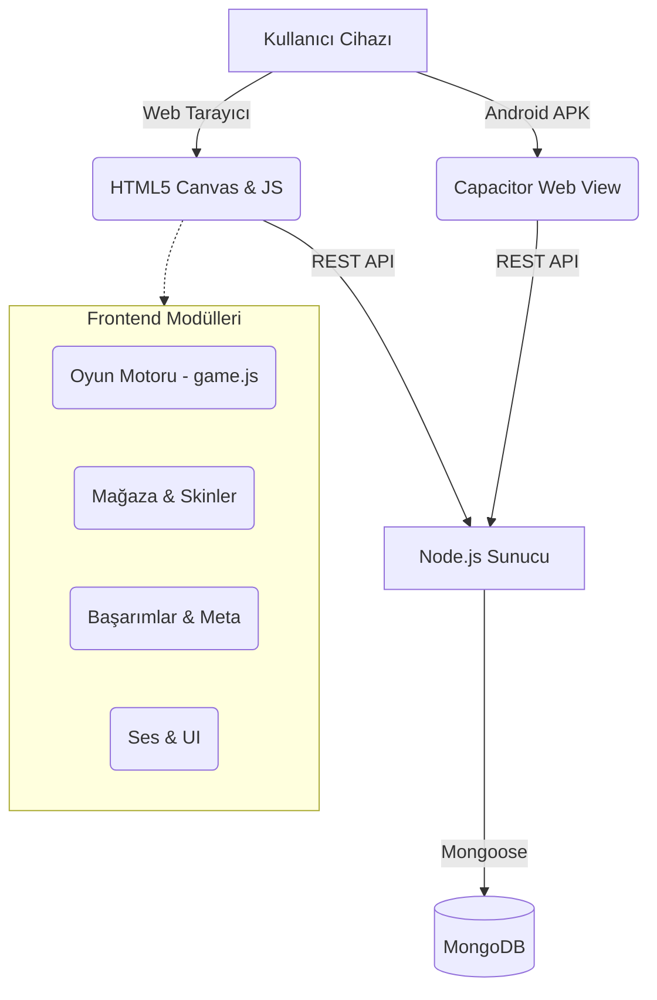

<div align="center">
  <h1>⬢ Hex Savaş ⬢</h1>
  <p><strong>Öğrenci Adı Soyadı:</strong> Arda Elitez | <strong>Öğrenci Numarası:</strong> 24010501118</p>

  []()
  []()
  []()
  []()
  
  <br>
  <i>Stratejik yerleştirme ve takım kompozisyonuna dayalı, çapraz platform destekli yeni nesil Auto Battler oyunu.</i>
</div>

---

## 📑 İçindekiler
1. [Projenin Amacı ve Özeti](#-projenin-amacı-ve-özeti)
2. [Teknolojik Altyapı ve Mimari](#-teknolojik-altyapı-ve-mimari)
3. [Klasör ve Modül Yapısı](#-klasör-ve-modül-yapısı)
4. [Oyun Mekanikleri ve Sinerjiler](#-oyun-mekanikleri-ve-sinerjiler)
5. [Veritabanı Şeması](#-veritabanı-şeması)
6. [Kurulum ve Çalıştırma](#-kurulum-ve-çalıştırma)
7. [Ekran Görüntüleri](#-ekran-görüntüleri)
8. [Kaynakça](#-kaynakça)

---

## 📌 Projenin Amacı ve Özeti

**Hex Savaş**, oyuncuların stratejik düşünerek birimler satın aldığı, bu birimleri altıgen (hex) tabanlı bir savaş alanına yerleştirdiği ve dalga dalga gelen düşmanlara (ve her 5 rauntta bir gelen Boss karakterlere) karşı hayatta kalmaya çalıştığı bir *Auto Battler* (Otomatik Savaş) oyunudur.

> [!NOTE]
> Projenin asıl yenilikçi tarafı, devasa oyun motorları (Unity, Unreal) kullanılmadan **saf Vanilla JavaScript ve HTML5 Canvas API** ile sıfırdan performanslı bir oyun motoru yazılmış olmasıdır. Proje aynı zamanda **Capacitor** sayesinde Native Android uygulamasına dönüşebilen **çapraz platform** bir yapıya sahiptir.

---

## ⚙️ Teknolojik Altyapı ve Mimari

Proje, hem istemci (client) tarafında zengin bir görsel deneyim sunmayı hem de sunucu (server) tarafında global veri yönetimini hedeflemiştir.



| Katman | Teknoloji / Araç | Görevi |
|--------|------------------|---------|
| **Frontend** | HTML5, CSS3, Vanilla JS | Oyun döngüsü, hex grid matematiği, partikül sistemleri ve UI. |
| **Backend** | Node.js, Express.js | Global skor tablosu, oyuncu hesap yönetimi ve API endpoint'leri. |
| **Veritabanı**| MongoDB (Mongoose) | Verilerin kalıcı olarak saklanması ve sorgulanması. |
| **Mobil Çıktı**| Capacitor | Web uygulamasını yerel Android cihaz özelliklerine entegre ederek APK üretimi. |

---

## 📁 Klasör ve Modül Yapısı

Klasör yapısı, projenin okunabilirliğini ve sürdürülebilirliğini sağlamak için modüllere ayrılmıştır.

```text
HexSavas/
├── www/                        # Frontend tarafını oluşturan çekirdek dosyalar
│   ├── index.html              # DOM yapısı ve oyun ekranının yerleşimi
│   ├── styles.css              # Glassmorphism tasarımlar, animasyonlar ve CSS değişkenleri
│   ├── game.js                 # 71KB - Hex matematiği, yapay zeka, pathfinding ve ana döngü
│   ├── store.js                # Kasa açılım mantığı, pity (garanti eşya) sistemi
│   ├── skins.js                # Birim kostümleri, nadirlik seviyeleri ve kuşanma kontrolleri
│   ├── achievements.js         # Tetikleyici bazlı 22 adet oyun içi başarım kontrolü
│   ├── leaderboard.js          # REST API aracılığıyla sunucu ile skor senkronizasyonu
│   ├── quests.js               # Günlük yenilenen görev atamaları ve ödül dağıtımı
│   ├── meta_progression.js     # Boss ruhları ile kalıcı pasif güçlendirmeler
│   ├── audio.js                # Web Audio API ile dinamik ses efektleri
│   └── assets/                 # Oyun ikonları, sprite'lar ve ses dosyaları
├── server.js                   # 12KB - Node.js API katmanı, MongoDB bağlantısı ve güvenlik
├── package.json                # Proje bağımlılıkları (Mongoose, Capacitor vb.)
├── android_guncelle.ps1        # Yeni kodları www'dan android/app'e aktaran script
├── build_apk.bat               # Otomatik Android derleme scripti
└── 24010501118.md              # Teslim dokümanı (Bu dosya)
```

---

## 🗄️ Veritabanı Şeması

Arka planda çalışan Node.js sunucusu, oyuncu verilerini saklamak için MongoDB kullanmaktadır. `server.js` içerisinde tanımlanan ana şema aşağıdaki gibidir:

| Alan (Field) | Tip (Type) | Açıklama |
|--------------|------------|-----------|
| `username` | String | Kullanıcının eşsiz adı. |
| `deviceId` | String | Cihazı tanımlayan benzersiz kimlik (Auth için). |
| `bestScore` | Number | Ulaşılan en yüksek skor. |
| `bestRound` | Number | Hayatta kalınan en uzun raund sayısı. |
| `scores` | Array | Skorların geçmiş kaydı (Score, Round, Wins, Kills, Date). |
| `gameData` | Object | Tüm JSON formatındaki meta, skin, hazine verilerinin bulut yedeği. |

> [!TIP]
> `gameData` objesi sayesinde kullanıcılar cihaz değiştirseler bile oyundaki ilerlemelerini (kazanılan skinler, altınlar ve başarımlar) kaybetmezler. `leaderboard.js` modülü bu objeyi sunucu ile senkronize eder.

---

## ⚔️ Oyun Mekanikleri ve Sinerjiler

Oyunda her sınıfın ve ırkın farklı avantajları vardır. Tahtada doğru kombinasyonları (Sinerji) kurmak kazanmanın anahtarıdır.

### 🛡️ Temel Sinerjiler
* **Savaşçı (2 Birim):** Birliklerin %20 Kritik vuruş şansı kazanmasını sağlar.
* **Büyücü (2 Birim):** Tüm büyücülerin saldırı gücünü %30 artırır.
* **Orman (2 Birim):** Orman ırkına mensup birimlerin hareket ve saldırı hızını %20 artırır.
* **İnsan (2 Birim):** Takımın toplam HP kapasitesine %15 ekler.

### 🐲 Boss Seviyeleri
Her 5 turda bir oyun mekaniğini değiştiren güçlü boss'lar gelir:
1. **Tier 1 (Tur 5-20):** Orman Kurdu, Taş Golem
2. **Tier 2 (Tur 25-40):** Ejderha (Ateş Nefesi alanı hasarı vurur)
3. **Tier 3 (Tur 45-60):** Kraken, Kemik Ejderhası
4. **Tier 5 (Tur 85-100):** Kaos Tanrısı (Nihai sınav)

---

## 🚀 Kurulum ve Çalıştırma

**Gereksinimler:** Node.js v16+, MongoDB (lokal veya URI üzerinden).

1. **Projeyi indirin ve klasöre girin:**
   ```bash
   git clone https://github.com/ArdaElitez/HexSavas.git
   cd HexSavas
   ```

2. **Bağımlılıkları yükleyin:**
   ```bash
   npm install
   ```

3. **Sunucuyu Başlatın:**
   ```bash
   npm start
   ```
   > Konsolda `✅ MongoDB veritabanına bağlanıldı!` mesajını göreceksiniz. Ardından tarayıcınızda `http://localhost:3000` adresine girerek oyunu oynayabilirsiniz.

4. **Android APK Derleme (Opsiyonel):**
   Eğer projenin APK halini çıkarmak istiyorsanız:
   ```bash
   .\android_guncelle.ps1
   .\build_apk.bat
   ```

---

## 📸 Ekran Görüntüleri

| **Ana Menü & Arayüz** | **Savaş Hazırlık Ekranı** |
|:---:|:---:|
|  |  |
| Zengin modüler ana ekran. | Altıgen grid sistemi ve mağaza. |

| **Mağaza (Gacha Sistemi)** | **Kostümler (Skins)** |
|:---:|:---:|
|  |  |
| Bronzdan Mitik sandığa kadar kasa açılımları. | Birimlerin nadirlik seviyesine göre özelleştirilmesi. |

| **Rehber ve Eğitim** | **Başarımlar Sistemi** |
|:---:|:---:|
|  |  |
| Oyun mekanikleri eğitim sayfası. | İlerlemeyi kaydeden görev ve ödül sistemi. |

---

## 📚 Kaynakça

Dokümantasyon ve geliştirme sürecinde aşağıdaki teknik dökümanlardan yoğun şekilde faydalanılmıştır:

1. **MDN Web Docs - HTML5 Canvas API:** Oyun içi karakter çizimleri, partikül sistemleri ve grid algoritmaları için. [Canvas API](https://developer.mozilla.org/en-US/docs/Web/API/Canvas_API)
2. **Red Blob Games - Hexagonal Grids:** Hex tabanlı oyun matematiği, pixel'den hex'e dönüşüm ve mesafe algoritmaları. [Hexagon Grids](https://www.redblobgames.com/grids/hexagons/)
3. **Capacitor Documentation:** Web kodlarının Native Android yapısına büründürülmesi. [Capacitor Docs](https://capacitorjs.com/docs)
4. **Mongoose & Express:** Sunucu ve veritabanı şema kurguları için. [Mongoose Docs](https://mongoosejs.com/)
5. **Google Fonts & Material Icons:** Oyun içi tipografi (Orbitron, Inter) ve UI sembolleri. [Google Fonts](https://fonts.google.com/)
